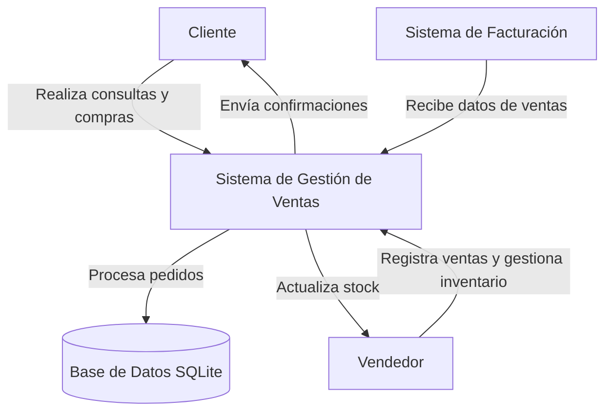
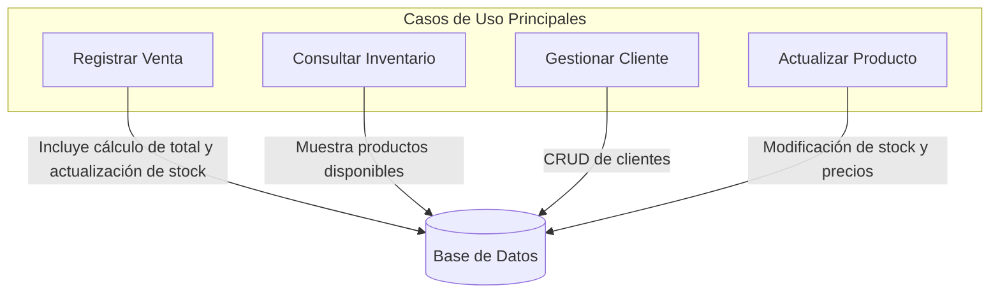
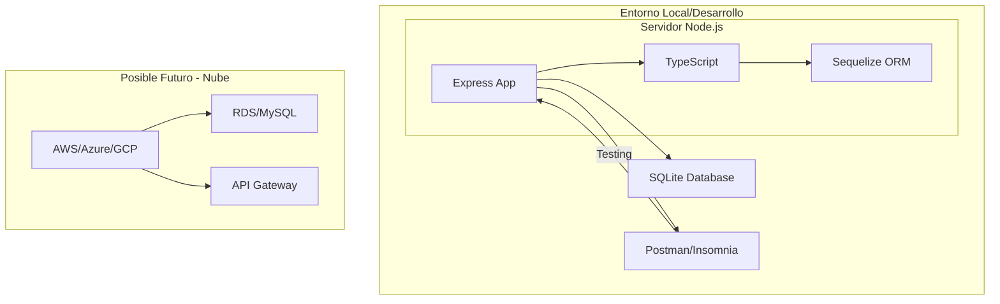

# Vistas Arquitectónicas - Sistema de Gestión de Ventas

## Vista de Contexto



**Actores Externos:**
- **Cliente**: Consulta productos, realiza compras
- **Vendedor**: Gestiona inventario, registra ventas
- **Sistema de Facturación**: Recibe datos para facturación automática

## Vista Funcional



**Casos de Uso:**
- Registrar venta (cliente + productos + total + actualización stock)
- Consultar inventario (productos disponibles)
- Gestionar cliente (crear, consultar, actualizar)
- Gestionar producto (crear, actualizar inventario, consultar)

## Vista de Información (Modelo ERD)

```mermaid
erDiagram
    CLIENTE ||--o{ VENTA : tiene
    PRODUCTO ||--o{ VENTA_PRODUCTO : "se vende en"
    VENTA ||--o{ VENTA_PRODUCTO : contiene

    CLIENTE {
        int id PK
        string nombre
        string email
        string telefono
        datetime fecha_creacion
    }

    PRODUCTO {
        int id PK
        string nombre
        decimal precio
        int stock
        datetime fecha_creacion
    }

    VENTA {
        int id PK
        int cliente_id FK
        decimal total
        datetime fecha_venta
    }

    VENTA_PRODUCTO {
        int venta_id FK
        int producto_id FK
        int cantidad
        decimal precio_unitario
        PK(venta_id, producto_id)
    }
```

**Relaciones:**
- Cliente ↔ Venta (1:N)
- Producto ↔ Venta (N:M) a través de VENTA_PRODUCTO
- Venta calcula total basado en productos y cantidades

## Vista de Despliegue



**Componentes Físicos:**
- **Servidor**: Node.js con Express y TypeScript
- **Base de Datos**: SQLite (desarrollo), potencialmente PostgreSQL/MySQL en producción
- **Entorno**: Local inicialmente, preparado para despliegue en nube
- **Herramientas de Testing**: Postman o Insomnia para pruebas de API